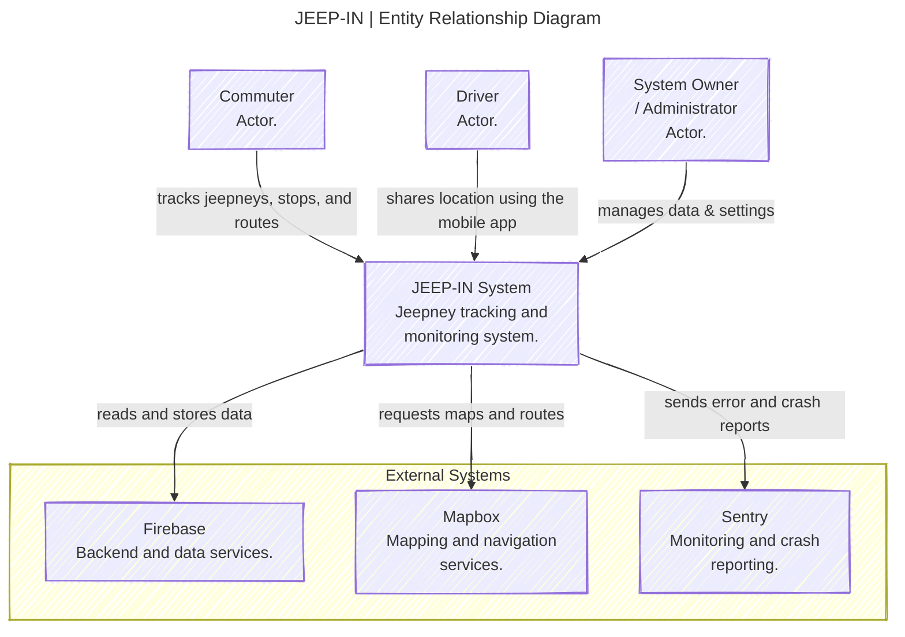
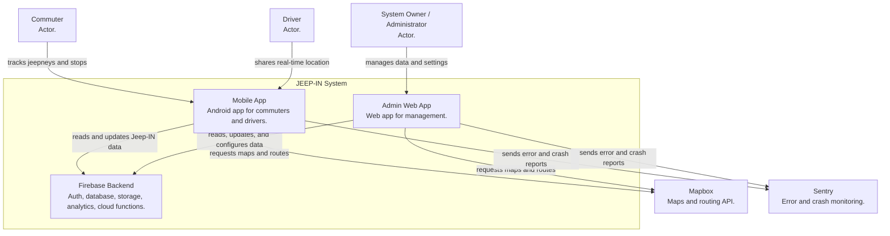
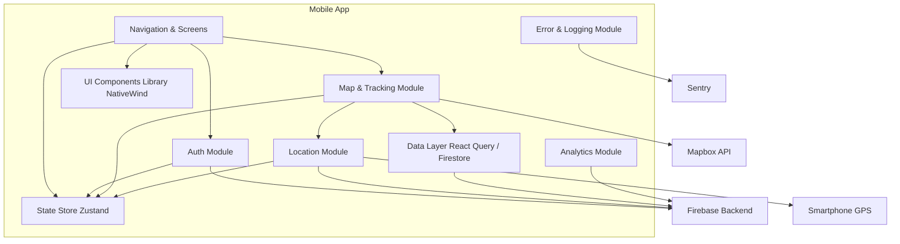
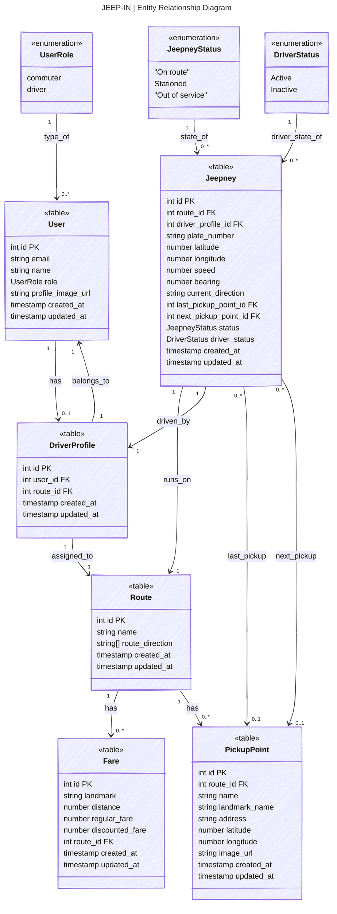

# 🚍 JEEP-IN: A TRACKING SYSTEM FOR MODERN JEEPNEYS IN ILOCOS NORTE

**Capstone Project**  
_In partial fulfillment of the requirements for the degree of Bachelor of Science in Information Technology._

## 📌 Project Description

**JEEP-IN** is a mobile-based real-time tracking system built to modernize public transportation in Ilocos Norte by leveraging GPS. This system improves visibility, route clarity, and commuter convenience by allowing passengers to track jeepneys, view stop points, and access relevant route data.

The app supports 2 roles: **Commuter** and **Driver**, each with tailored dashboards and features.

## 👨‍💻 Developer

- Bryan Jesus B. Mangapit

## 🚀 Core Features

### 🧭 Commuter Features

- 📍 Real-time tracking of jeepneys
- 🗺️ Interactive map with route and stop points
- 🔎 Search for jeepneys and stops
- 🧾 Fare guide information

### 👨‍✈️ Driver Features

- 📡 Background location sharing
- 🚐 View assigned jeepney and route

## 🛠️ Tech Stack

- **Frontend:** React Native + Expo
- **Authentication:** Firebase Authentication
- **Database:** Firebase Firestore
- **Location & Maps:** Mapbox SDK
- **State Management:** Zustand, Tanstack Query, Expo Secure Store
- **Navigation:** Expo Router

## 🧠 Architectural Highlights

- ✅ Clean role-based layouts via folder routing
- ✅ Firebase modular SDK for scalable backend logic
- ✅ Shared reusable components for map markers, floating cards, and more
- ✅ Direction API integration with Mapbox for ETA & distance calculation

## ⚙️ Setup & Installation

### 1️⃣ Clone the Repository

```bash
git clone https://github.com/bruhhhyannnn/JEEP-IN.git
cd JEEP-IN
```

### **2️⃣ Install Dependencies**

```bash
npm install
```

### **3️⃣ Start the App**

```bash
npx expo start
```

## 📝 Notes

- ✅ Ensure your .env file is properly configured with your Firebase and Mapbox credentials.
- ✅ Mapbox API is used for custom map rendering and routing.
- ✅ Future updates will include background location tracking for drivers, admin data analytics, and trip history features.

---

👨‍💻 Crafted with care by:

- 💡 Jared Jeffrey V. Agruda
- 🧠 Abijah Mcguiller B. Barruga
- ⚙️ Bryan Jesus B. Mangapit
- 🛰️ Mark Neilsen B. Paguirigan

📍 MMSU | Bachelor of Science in Information Technology

---

## C4 Model Diagram

##### System Context Diagram



##### Container Diagram



##### Component Diagram



---

## UML Use-Case Diagram

```mermaid
---
title: JEEP-IN | UML Use-Case Diagram
config:
  theme: default
  look: handDrawn
---

```

---

## Entity Relationship Diagram


